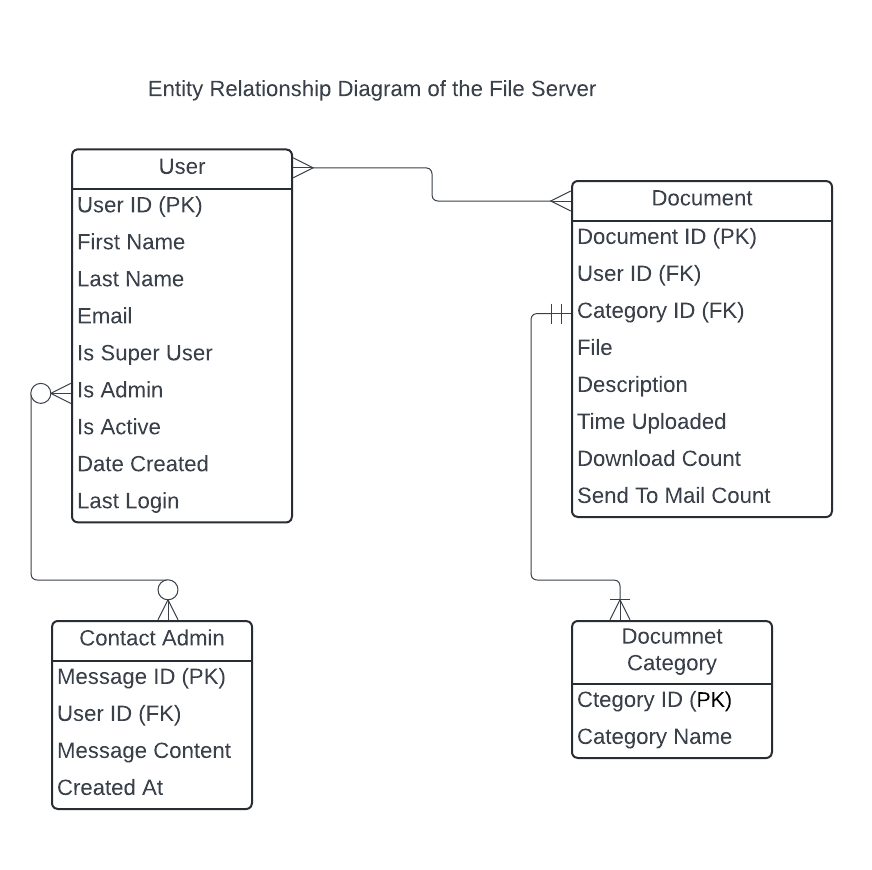

# File Server Project
----------------------
## Description
### This project aims to develop a web application for a document distribution business.
### This digital platform will provide a centralized location for document storage and distribution, offering several key advantages.
### **Customer / user requirements**
+ Signup & log in with an email and password with account verification
+ There should be a reset password feature to recover lost passwords password.
+ Feed page that contains a list of files that can be downloaded.
+ Search and filter the file server
+ Send a file to an email through the platform
### **Admin** 
+ Upload files with a title and description
+ Be able to see the number of downloads and number of emails sent for each file
----------------------
## Technologies stack
+ Django: Python web framework for building the backend.
+ Html & Bootstrap : Html & Bootstrap was used for template and styling for the frontend
+ MySQL: Relational database management system for storing user data.
+ LucidChat: A software that was used to design the ER diagram

## ER Diagram
### ER diagram document can be found at ***ER_Diagram/file_server_er_diagram***

  
## Getting Started
  #### To run this project locally, follow these steps;
 + Clone this repository. `code ` git clone https://github.com/Tito-Curtis/File-Server-Project
 + Install the necessary dependencies using pip install -r requirements.txt
 + Apply database migrations using python manage.py migrate.
 + Start the development server using python manage.py runserver.

## Deployment Link

[Link Text](https://lizzy-files.onrender.com)

## Contribution
#### Contributions are welcome! If you have any suggestions or improvements, please feel free to open an issue or submit a pull request.

## License

